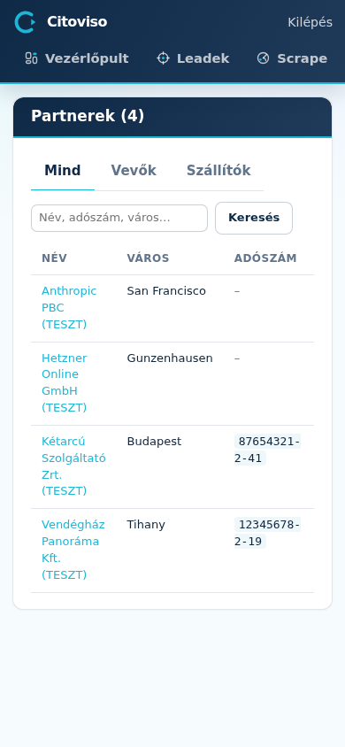

A **„Partnerek”** menüpont a cég összes számviteli partnerét mutatja egy listában: a vevőket
(akiknek számlát állítunk ki) és a szállítókat (akiktől számlát kapunk — pl. tárhely,
AI-szolgáltatás). Egy partner lehet egyszerre mindkettő; ilyenkor mindkét jelölést viseli.

## Honnan kerülnek ide a partnerek?

A vevő-partner **magától születik az első fizetéskor**: a megrendelésnél megadott számlázási
nyilatkozatból (jogi név, adószám, cím) jön létre, ezért nem kell kézzel felvenni. A szállítói
partnerek a bejövő bizonylatok rögzítésekor kerülnek a törzsbe. Az adószám egyedi — ugyanaz a
cég nem szerepelhet kétszer.

## Szűrés és keresés

- A **„Mind”** / **„Vevők”** / **„Szállítók”** fülekkel szerep szerint szűrhet.
- A kereső mezőbe (**„Név, adószám, város…”**) írjon be egy név-, adószám- vagy várostöredéket,
  majd nyomja meg a **„Keresés”** gombot. A szűrő és a keresés együtt is működik.

## Mit mutatnak az oszlopok?

- **Típus** — vevő és/vagy szállító jelölés.
- **Bizonylat (db)** — hány számla/bizonylat tartozik a partnerhez.
- **Forgalom** — vevőnél a neki kiszámlázott bruttó összeg; tiszta szállítónál a nála elköltött
  összeg. Devizánként külön jelenik meg (forint, euró), mert különböző pénznemeket nem adunk össze.
- **Kintlévőség** — a még kiegyenlítetlen bizonylatok összege: vevőnél az ő tartozása felénk,
  szállítónál a mi nyitott tartozásunk. Kettős szerepű partnernél a szállítói oldal külön,
  halvány sorban látszik („költés”, „tartozásunk”).

A partner nevére kattintva nyílik a partner-lap, rajta az előzményekkel, előfizetéssel,
bizonylatokkal és kapcsolattartókkal.
