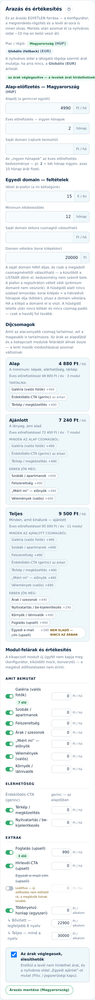

Az **„Árazás”** képernyőn állítod be a valós árakat, régiónként. Ezek az árak jelennek meg a
prospect-konfigurátorban és a nyilvános oldalon — és itt van az a kapcsoló is, ami nélkül a
rendszer egyáltalán nem hirdethet árat.

## Régió-váltó

A panel tetején a régiók között váltasz (Magyarország = HUF, Globális = EUR fallback). Minden
régiónak saját ár-sora van; amelyik régióra nincs mentett ár, az a globálisra esik vissza.

## Az ár-mezők

- **„Alapdíj (a gerinccel együtt)”** — a havi előfizetés alapára; a gerinc (honlap + érdeklődés-CTA)
  benne van.
- Éves előfizetésnél ingyenes hónapokat adsz (12 − N hónap árát fizeti).
- **Saját domain** — a rajtunk keresztül intézett egyedi domain éves díja.
- **Modul-árak** — modulonkénti havi felár, a konfigurátor ugyanebből számol.

## Egyedi domain — feltételek (ADR-0093)

Az **„Egyedi domain — feltételek”** blokk a domain-üzlet szabályait állítja:

- **„Vételi ár-plafon (a mi költségünk)”** — euróban: ennél drágább domaint a rendszer NEM
  vesz meg (a prémium/emelt díjas nevek így nem csúszhatnak át az automata vásárláson). A
  vevő az ilyen névre már az ellenőrzésnél elutasítást lát. Ez EGY közös érték: a
  **Magyarország** lapon állítod, és minden vételre az érvényes — a többi régió lapján a
  mező csak erre mutat.
- **„Minimum elköteleződés”** — hány hónap előfizetést vállal, aki rajtunk keresztül kér
  domaint. Ez kerül a megrendelésre és az áttekintő képernyőre is.
- **„Ingyen domain ekkora csomagtól”** — ha a vevő havi csomagja eléri ezt az összeget, a
  domain éves díját elengedjük (0 Ft-ot lát az áttekintésben).
- **„Domain vételára (korai kilépéskor)”** — a hűségidő alatt nincs szabad lemondás
  (ADR-0094): a korai kilépő a hátralévő hónapok díját (kötbér) mindig megfizeti, a domain
  vételárát pedig CSAK akkor, ha a domaint el is viszi. Ha nem viszi, a domain nálunk marad.

## Az ár-hirdetési kapu (Fttv./§C)

A mentés fölött egy jelölőnégyzet: **„Az árak véglegesek, élesíthetők”**. Amíg NINCS bepipálva,
a kiküldött levél nem hirdethet árat, és a nyilvános oldal „Egyedi ajánlat”-ot mutat. Ez
fogyasztóvédelmi kapu (megtévesztő ár-állítás tilalma) — csak akkor pipáld be, ha az árak
tényleg véglegesek.

## Mentés

Az **„Árazás mentése”** gomb a kiválasztott régió árait menti. A mentés azonnal él: a következő
konfigurátor-megnyitás és mock-kiküldés már az új árakkal számol. Régiónként külön ments —
a magyar mentés a globálist nem írja át.
