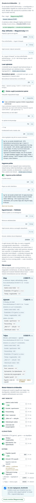

Az **„Árazás és értékesítés”** képernyőn állítod be a valós árakat régiónként, és itt döntöd el
modulonként, hogy egyáltalán **eladható-e**. Ezek az árak jelennek meg a prospect-konfigurátorban
és a nyilvános oldalon — és itt van az a kapcsoló is, ami nélkül a rendszer egyáltalán nem
hirdethet árat.

**Hol találod:** a bal oldali menüben a **CRM** modul alatt, **„Árazás és értékesítés”**
néven (a menüben röviden **„Árazás”**). (Korábban a **„Pénzügy”** alatt volt — 2026-09-06 óta a CRM-hez tartozik, mert
értékesítési döntés.) Az Irányítópulton a CRM-kártyán is ott a sora, mellette egy jelvény, ami
mutatja, hány modul eladható a katalógusból (például „13/14 eladó”).

## Régió-váltó

A panel tetején a régiók között váltasz (Magyarország = HUF, Globális = EUR fallback). Minden
régiónak saját ár-sora van; amelyik régióra nincs mentett ár, az a globálisra esik vissza.

## Az ár-mezők

- **„Alapdíj (a gerinccel együtt)”** — a havi előfizetés alapára; a gerinc (honlap + érdeklődés-CTA)
  benne van.
- Éves előfizetésnél ingyenes hónapokat adsz (12 − N hónap árát fizeti).
- **Saját domain** — a rajtunk keresztül intézett egyedi domain havi díja.
- **Modul-árak** — modulonkénti havi felár, a konfigurátor ugyanebből számol.

## Lead-ajánlatok — a bemutatkozó és a döntés-segítő ajánlat

A **„Lead-ajánlatok”** szekció az „Alap-előfizetés” blokk alatt, az „Egyedi domain — feltételek” előtt van. Itt állítod be,
mekkora kedvezményt ígér a kiküldött levél, és mikor, mekkora, meddig érvényes plusz kedvezményt kap az a lead,
aki többször is megnyitja a neki küldött tervet, de még nem rendelt. Ez a beállítás **„minden piacra érvényes”**:
bármelyik régió oldalán ugyanazt látod, és bármelyik régió mentése menti.

Hogyan működik: a kiküldött levél egy bemutatkozó kedvezményt ígér, ez az első megnyitástól határidő nélkül él. Ha
a lead a tervet a megadott számú alkalommal megnyitja, és még nem vásárolt, a lap egy döntés-segítő ajánlatot mutat
neki: nagyobb kedvezményt az első díjból, a megadott ideig. Ha addig sem rendel, a megadott késleltetés után
e-mailben is emlékeztetjük rá, ha van e-mail címe, nem iratkozott le, és az ajánlat még nem járt le. Az emlékeztetőt
óránként küldjük, reggel 8 és este 8 óra között: az éjjel esedékes emlékeztető reggel 8 után megy ki. Egy ajánlatra
legfeljebb egy emlékeztető megy. Egy kiküldött tervre az ajánlat egyszer jár.

**Bemutatkozó ajánlat**

1. **„Bemutatkozó kedvezmény (a levéllel jár)”**: egész százalék 5 és 50 között. Ezt a százalékot írja bele a
   levél az ajánlatba. Kisebbnek kell lennie a döntés-segítő kedvezménynél. A mező alatt a Magyarország oldalon egy
   példa mutatja, mennyi lesz a középső csomag első havi díja.
2. A levél %-a köt: a kiküldéskor a rendszer rögzíti, hány százalékot ígért a levél. Ha később átállítod, a már
   kiküldött levelek leadjei a levelükben ígért kedvezményt kapják, akkor is, ha még meg sem nyitották. Az új érték
   csak az ezután kiküldött levelekre vonatkozik. Ha ugyanannak a leadnek később újabb levél megy, az is az első
   levél százalékát idézi.

**Döntés-segítő (eszkalációs) ajánlat**

1. A **„Döntés-segítő (eszkalációs) ajánlat”** kapcsolóval kapcsolod be vagy ki. Kikapcsolva egyetlen leadnek sem
   születik új ajánlat, a négy mező tiltott, a legutóbb mentett számok megmaradnak, visszakapcsoláskor nem kell újra
   beírnod őket. A bemutatkozó kedvezményt a kapcsoló nem érinti.
2. **„Hányadik megnyitásnál kapja”**: egész szám 2 és 10 között. Az első megnyitás maga a levél linkje, ott még a
   bemutatkozó kedvezmény a helyén, ezért legalább 2.
3. **„Kedvezmény az első díjból”**: egész százalék, nagyobb a bemutatkozó kedvezménynél, legfeljebb 90. A
   kedvezmények nem adódnak össze, mindig a legnagyobb érvényes: ha a bemutatkozóval egyenlő vagy kisebb lenne, a
   lead soha nem kapná meg.
4. **„Az ajánlat érvényessége”**: egész óra 24 és 168 (7 nap) között. Alatta napban is látod (pl. „= 3 nap”).
5. **„Emlékeztető levél a kiadás után”**: egész óra, legalább 1, és kevesebb az érvényességnél. Alatta ez áll:
   „Utána legfeljebb még … óra marad a döntésre.” Az emlékeztetőt óránként küldjük, 8 és 20 óra között, ezért a
   levél legfeljebb egy órával a beállított idő után megy ki, éjjel pedig reggel 8-ig vár. Ha az emlékeztető után
   legfeljebb 12 óra marad a lejáratig, a mező alatt az is megjelenik, hogy egy éjszakára eső lead nem kapja meg.

**Hibák és mentés**

- A mezők alatti keretes mondat előre megmutatja, mit fog tenni a beállításod, a Magyarország oldalon egy valós
  csomagár-példával.
- Ha egy mező üres, nem egész szám, vagy a tartományon kívül esik, a hibás mező pirosan keretezett, alatta ott az
  ok. Két mező egymáshoz képest is lehet hibás: ha a döntés-segítő kedvezmény nem nagyobb a bemutatkozónál, vagy
  az emlékeztető nem korábbi a lejáratnál, mindkét mező piros lesz, bármelyiket javíthatod. Kikapcsolt
  döntés-segítőnél a bemutatkozó kedvezményt a tárolt döntés-segítő kedvezményhez méri. Ilyenkor csak a bemutatkozó
  mező lesz piros: vagy csökkented, vagy visszakapcsolod a döntés-segítőt, és ott emeled a kedvezményt.
- Hiba esetén az **„Árazás mentése”** gomb nem nyomható meg. A gomb a lap alján van, mellette ez áll: „A mentés
  addig nem megy, amíg a jelölt mező hibás.” Ha több mező hibás, a szám is ott áll, pl. „A mentés addig nem megy,
  amíg a 2 jelölt mező hibás.” A javítandó mezőt a piros keret mutatja fent, a „Lead-ajánlatok” szekcióban.
  Telefonon oda vissza kell görgetned.

**Mi történik a már futó ajánlatokkal?**

- A már kiadott döntés-segítő ajánlat megtartja a saját kedvezményét és lejáratát. Ha a kapcsolót, a
  megnyitás-számot, a kedvezményt vagy az érvényességet átállítod, miközben ilyen ajánlatok futnak, a mezők alatt
  megjelenik, hány darab fut és hány százalékkal.
- Ha a bemutatkozó kedvezményt állítod át, ott az jelenik meg, hogy a már kiküldött levelek a bennük ígért
  kedvezményt tartják.
- Az emlékeztető késleltetése viszont a már futó ajánlatokra is hat: minden óránkénti küldés a kiadás óta eltelt
  időből számol. Ha az ajánlat addigra lejár, nem megy ki emlékeztető. A felület ezt is kiírja, ha a késleltetést
  átállítod.

## Modul-felárak és értékesítés — az eladhatóság kapcsolója

A **„Modul-felárak és értékesítés”** blokkban minden felárazott modul sorában van egy
kapcsoló és egy ár-mező. (A gerinc-elemek kivételek: náluk „gerinc — az alapdíjban” áll,
mert az alapdíj tartalmazza őket — se kapcsolójuk, se külön áruk nincs.)

A kapcsoló azt dönti el, hogy a modul **új ügyfélnek eladható-e**:

- **Bekapcsolva** — a modul normálisan megjelenik az ajánlatban.
- **Kikapcsolva** — a modul neve áthúzva jelenik meg, és a sor kiírja: **„Leállítva — új
  előfizetés nem köthető rá; a meglévők futnak tovább.”**

A blokk címe alatt a képernyő ezt ki is mondja: „A kikapcsolt modult új ügyfél nem kapja meg
(konfigurátor, kiküldött mock, konverzió) — a meglévő előfizetéseket nem érinti.”

> ⚠️ **A Többnyelvű honlap három sávja külön árazódik.** A „Többnyelvű honlap” sorban az
> **Alap** csomag ára áll, alatta pedig — saját, behúzott sorban — a **Bővített** és a
> **Teljes** sáv ára is szerkeszthető, ugyanúgy számmezőben. Mindhárom **egyszeri** díj
> („Ft / alkalom”), nem havidíj. A mentés mindhármat egyszerre viszi.

⚠️ **Mit jelent ez a gyakorlatban?** A kikapcsolás MIND A NÉGY eladási pontot lezárja: a
prospect-konfigurátorban nem választható, a kiküldött mockban mintaként sem jelenik meg,
konverziókor sem kerül bele a csomagba, és a tenant-admin sem tud rá előfizetni. Aki viszont
MÁR fizet érte, annak változatlanul megy tovább, és kezelni is tudja.

Ha egy modulra már van élő előfizetés, a neve mellett egy jelvény mutatja a darabszámot
(például „3 élő”). Ez a figyelmeztetésed: a kikapcsolás őket nem vágja el, de új ügyfelet
nem szerzel rá többé.

**Mikor kapcsold ki?** Ha a modul még nincs kész az értékesítésre (nincs kidolgozva a
folyamat, nincs marketing-anyag, vagy még nem tudod kiszolgálni). Az egyedi e-mail cím modul
például alapból ki van kapcsolva — külön marketing-körrel indul.

## Egyedi domain — feltételek

Az **„Egyedi domain — feltételek”** blokk a domain-üzlet szabályait állítja:

- **„Vételi ár-plafon (a mi költségünk)”** — euróban: ennél drágább domaint a rendszer NEM
  vesz meg (a prémium/emelt díjas nevek így nem csúszhatnak át az automata vásárláson). A
  vevő az ilyen névre már az ellenőrzésnél elutasítást lát. Ez EGY közös érték: a
  **Magyarország** lapon állítod, és minden vételre az érvényes — a többi régió lapján a
  mező csak erre mutat.
- **„Minimum elköteleződés”** — hány hónap előfizetést vállal, aki rajtunk keresztül kér
  domaint. Ez kerül a megrendelésre és az áttekintő képernyőre is.
- **„Saját domain ekkora csomagtól választható”** — ez BELÉPÉSI FELTÉTEL, nem kedvezmény:
  aki ennél kisebb csomagot választ, annak a saját domain nem olcsóbb, hanem
  egyáltalán nem elérhető — a konfigurátorban meg sem jelenik választható lehetőségként,
  csak egy ajánló kártya mutatja, mennyi hiányzik hozzá. ⚠️ A küszöböt a **listaár** dönti
  el: a kedvezmény (pl. a bemutatkozó −25%) NEM számít bele, mert egy időszakos engedmény
  nem vehet meg egy tartós jogosultságot.
- **„Saját domain (rajtunk keresztül)”** — a név **havi** díja. Nincs ingyen-ág:
  a küszöb feletti csomag sem teszi ingyenessé, és a díj minden számlázási cikluson szerepel,
  amíg a név a vevőnél van. Kedvezmény erre a díjra SOHA nem megy (átfolyó registrar-költség).
- **„Domain vételára (korai kilépéskor)”** — a hűségidő alatt nincs szabad lemondás:
  a korai kilépő a hátralévő hónapok díját (kötbér) mindig megfizeti, a domain
  vételárát pedig CSAK akkor, ha a domaint el is viszi. Ha nem viszi, a domain nálunk marad.
  A hűségidő **letelte után** nincs kötbér és nincs csomag-minimum: a név díjmentesen a vevőé,
  és már csak a havi díj fut tovább, amíg nálunk tartja a nevet.

## Díjcsomagok — mit tartalmaz és mennyibe kerül

A **„Díjcsomagok”** blokk három kártyán mutatja, mit kap a vevő és mennyiért:
**Alap**, **Ajánlott**, **Teljes**. Az árat NEM külön írod be — az alapdíjból és a
bekapcsolt modulok felárából áll össze, tehát a lenti mezők módosítása azonnal
átírja a csomagárakat is.

**A szabály:** ami az alacsonyabb csomagban benne van, az benne van a magasabb
csomagban is. A kártyán ezért két lista szerepel: felül a kisebb csomagból örökölt
modulok (szaggatott keretű, halvány címkék — a fejlécük megnevezi, melyik csomagból
jönnek), alattuk pedig az **„Ebben jön még:”** lista (tömör címkék), ami a csomag
saját többlete. A legkisebb csomagnál csak egy lista van, **„Tartalma:”** fejléccel.
Így egy pillantással látod, mit ad hozzá az adott szint.

⚠️ Ha egy modult **kikapcsolsz** az eladásból, az kikerül a csomag árából is, és a
címkéje **„nem eladó — nincs az árban”** jelölést kap. Ez szándékos: a csomagár
mindig azt mutatja, amit a vevő ténylegesen meg tud vásárolni — ugyanazt a számot,
amit a konfigurátorban lát.

Ha a szabály valaha sérülne (egy modul kiesne a magasabb csomagból), a blokk alatt
piros figyelmeztetés jelenik meg, és a `configurator-price-check` kapu is elbukik —
nem lehet észrevétlenül elrontani.

## Az ár-hirdetési kapu (fogyasztóvédelmi kapu)

A mentés fölött egy jelölőnégyzet: **„Az árak véglegesek, élesíthetők”**. Amíg NINCS bepipálva,
a kiküldött levél nem hirdethet árat, és a nyilvános oldal „Egyedi ajánlat”-ot mutat. Ez
fogyasztóvédelmi kapu (megtévesztő ár-állítás tilalma) — csak akkor pipáld be, ha az árak
tényleg véglegesek.

## Mentés

Az **„Árazás mentése”** gomb (a felirat mögött ott a régió neve is) a kiválasztott régió árait
és az eladhatóság-kapcsolókat menti. A mentés azonnal él: a következő
konfigurátor-megnyitás és mock-kiküldés már az új árakkal számol. Régiónként külön ments —
a magyar mentés a globálist nem írja át. Kivétel a **„Lead-ajánlatok”** szekció: az minden
piacra közös, ezért bármelyik régió mentése menti.
