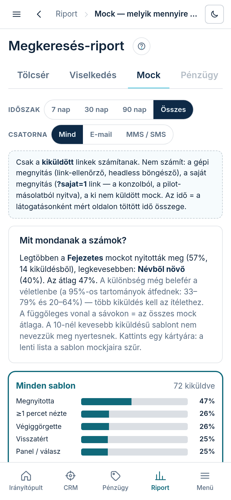
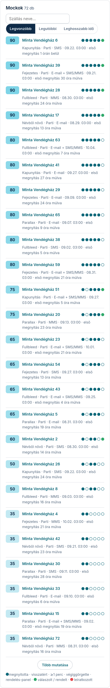

## Hol találod

A bal menüben **„Riport”** → **„Mock”**, vagy a Riport bármelyik lapján a fülsor **„Mock”** füle.

## Mit mutat

Ebből látod, melyik sablon működik. A szűrősor itt: **„Időszak”** (7 · 30 · 90 nap ·
**„Összes”**, a kiküldés dátuma szerint; ez a fül alapból az „Összes”-t mutatja) és
**„Csatorna”** (**„Mind”** · **„E-mail”** · **„MMS / SMS”**). Alatta a szaggatott keretes doboz
kimondja, mi számít: csak a kiküldött link; a gépi megnyitás, a saját (`?sajat=1`) megnyitás és a
ki nem küldött mock nem.

- **„Mit mondanak a számok?”**: a legalább 10 kiküldésű sablonok közül megnevezi a legnagyobb és a
  legkisebb megnyitási arányút, az átlaggal együtt, és megmondja, hogy a különbség **„még belefér
  a véletlenbe”** (a két 95%-os tartomány átfed — több kiküldés kell) vagy **„már nem véletlen”**.
  Ha nincs két ilyen sablon, ezt írja: „Ebben a szűrésben még nincs két sablon legalább 10
  kiküldéssel — nem lehet összevetni.”
- **Sablon-kártyák**: elöl a **„Minden sablon”**, utána sablononként (a legtöbb kiküldés elöl).
  Mindegyiken a kiküldések száma, 10 alatt a sárga **„kevés adat”** jel, és öt sáv a kiküldöttek
  százalékában: **„Megnyitotta”** → **„≥1 percet nézte”** → **„Végiggörgette”** →
  **„Visszatért”** → **„Panel / válasz”** (megnyitotta a rendelés-panelt, válaszolt vagy rendelt).
  A sávon a függőleges vonal az összes mock átlaga. Alatta **„Megnyitás az átlaghoz képest:”**
  +/− pont, legalul az **„Átlagos vonzóság”**.
- **Kártya = szűrő**: egy kártyára koppintva a lenti lista a sablon mockjaira szűr, a kártya
  kiemelt keretet kap, a lista fölött megjelenik a „Szűrve: <sablon neve>” sor. Ugyanarra a kártyára
  koppintva vagy a **„Minden sablon”** linkkel a szűrés megszűnik. Telefonon a lista magától a
  képbe gördül.
- **Vonzóság-pont (0–100)** mockonként, a kártyák alatt ki is van írva: megnyitotta 20 ·
  visszatért 15 · legalább 1 percet töltött rajta 15 · végiggörgette (≥75%) 15 · megnyitotta a
  rendelés-panelt 15 · válaszolt 10 · rendelt 10. A leiratkozott mock 0 pont.
- **„Mockok”** lista: a pont, a szállás neve (a lead-oldalra visz), hat pötty (megnyitotta ·
  visszatért · ≥1 perc · végiggörgette · rendelés-panel; a hatodik zöld = válaszolt vagy rendelt,
  piros = leiratkozott), asztalin a megnyitások száma, az idő és a görgetés; alatta sablon ·
  arculat · csatorna · a kiküldés ideje (Budapest) · az első megnyitás. Fölötte a **„Szállás
  neve…”** kereső és a rendezés: **„Legvonzóbb”** · **„Legutóbbi”** · **„Leghosszabb idő”**. A lista
  25-ösével nő a **„Több mutatása”** gombbal.

Az idő a látogatásonként mért, oldalon töltött idő ÖSSZEGE: aki kétszer 40 másodpercet nézte,
annál „≥1 perc” igaz.

