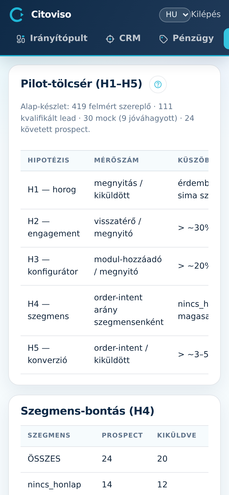

A Riport a pilot öt hipotézisét méri számokkal: kiküldéstől a konverzióig. Itt látod, hol
szivárog a tölcsér — és hogy a pilot-küszöbök teljesülnek-e.

## Pilot-tölcsér (H1–H5)

A **„Pilot-tölcsér (H1–H5)”** táblázat hipotézisenként mutatja a mérőszámot, a küszöböt és a
mostani értéket:

- **H1 — horog:** megnyitás / kiküldött. A személyre szabott mockos levél nyit-e jobban.
- **H2 — engagement:** visszatérő / megnyitó (küszöb ~30%). Visszajön-e még egyszer megnézni.
- **H3 — konfigurátor:** modul-hozzáadó / megnyitó (küszöb ~20%). Játszik-e a modulokkal.
- **H4 — szegmens:** az order-intent arány szegmensenként — a „nincs honlapja” körnek kell
  a legjobbnak lennie.
- **H5 — konverzió:** order-intent / kiküldött (küszöb ~3–5%). A lényeg.

A fejléc alatti sor az alap-készletet mutatja: felmért szereplő, kvalifikált lead, mock
(ebből jóváhagyott), követett prospect — így a százalékokat mindig a mögöttes darabszámmal
együtt látod (10%-nak 10 kiküldöttből nincs súlya).

## Szegmens-bontás (H4)

A **„Szegmens-bontás (H4)”** táblázat ugyanazt a tölcsért bontja szegmensenként (nincs honlapja /
elavult honlap …): prospect → kiküldve → megnyitva → visszatért → modul-piszkált → order-intent →
konvertált → leiratkozott. Az „ÖSSZES” sor az összesítés.

Fontos olvasási szabály: a tölcsér sosem regresszál — minden szám a legalább elért állapotot
jelenti, tehát aki konvertált, az a megnyitók között is ott van.

## Honnan jönnek a számok?

A lead-lapon a **„Kiküldve — mérés indul”** gombbal jelzett küldésektől; a megnyitást és az
aktivitást a követett prospect-link méri. Ami ott nincs bejelölve, az itt nem számít bele.
