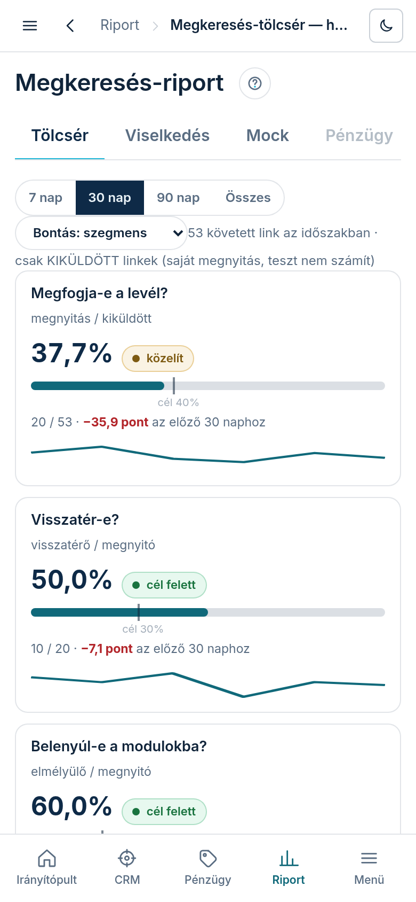
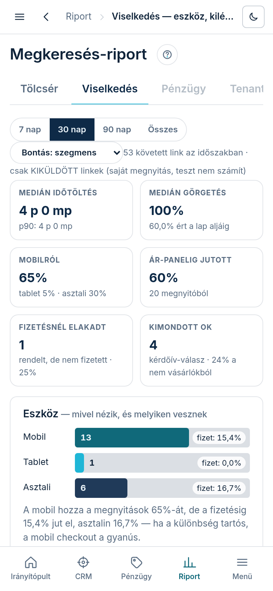

A Riport két lapon felel a pilot kérdéseire: a **„Tölcsér”** azt mutatja, hol szivárog el a
megkeresés a kiküldéstől a fizetésig, és javul-e hétről hétre; a **„Viselkedés”** azt, hogy
milyen eszközről nézik, hol lépnek ki, és — ahol meg tudjuk mondani — miért.

## Hol találod

A bal menüben **„Riport”** → **„Megkeresés-tölcsér”** vagy **„Viselkedés”**. A két lap teteje
azonos: a fülek (**„Tölcsér”** · **„Viselkedés”**) és a szűrősor. A szürke **„Pénzügy”** és
**„Tenantok”** fül még nem nyílik — a 2. és a 3. kör ide érkezik, addig csak a helyét mutatja.

## A szűrősor — minden szám erre számolódik

Egy sorban: az **időszak** chipjei (7 · 30 · 90 nap vagy **„Összes”**) és a **bontás**
legördülő (szegmens · csatorna · eszköz · mock-stílus · küldési óra). Minden panel a kiválasztott
időszakban KIKÜLDÖTT linkeket nézi — a saját megnyitásod és a teszt nem számít bele, a sor jobb
széle ezt ki is írja. A változás-számok („+3,7 pont”) az előző, ugyanakkora időszakhoz mérnek;
az **„Összes”** mellett ilyen összevetés nincs, ott egy kötőjel áll.

## Tölcsér — hat kérdés, hat kártya

Minden kártya egy kérdés, a mérőszám nevével, a nagy értékkel, az ítélettel és a célt jelölő
mérővel:

- **„Megfogja-e a levél?”** — megnyitás / kiküldött (cél 40%).
- **„Visszatér-e?”** — visszatérő / megnyitó (cél 30%).
- **„Belenyúl-e a modulokba?”** — elmélyülő / megnyitó (cél 20%). Elmélyült az, aki modult vagy
  presetet érintett, vagy a lap felénél lejjebb görgetett.
- **„Megrendeli-e?”** — rendelés / kiküldött (cél 4%).
- **„Ki is fizeti?”** — fizetve / rendelés (cél 75%). A „fizetve” a tényleges fizetésből jön,
  nem a lead állapotából.
- **„Gyorsan reagál-e?”** — a küldéstől az első megnyitásig eltelt idő mediánja (cél 24 óra).
  Itt a KISEBB a jobb.

Az ítélet-pill három szava: **„cél felett”** (zöld), **„közelít”** (borostyán), **„cél alatt”**
(piros); adat nélkül **„nincs adat”**. A „közelít” az arányoknál azt jelenti, hogy a cél 70%-át
már hozza; az idő-kártyánál fordítva: legfeljebb 30%-kal lassabb a célnál. A kártya alján a tört
(hány darabból), a változás az előző időszakhoz, és egy hat heti vonal: felfelé megy-e.

**Mediánt nézünk, nem átlagot:** egy 9 napos kivétel az átlagot elvinné; a medián a tipikus
leadet mutatja.

## Visszatérés, bontás, kohorsz, napló

- **„Visszatérés”**: hányan jöttek 1 / 2 / 3+ alkalommal, és közülük hányan rendeltek
  („rendel: 29%”). Alatta egy mondat az eszkalációs ajánlatról: hánynak jelent meg, hány
  kattintott, hány rendelt, hány vetette el.
- **„Bontás”**: a kiválasztott dimenzió szerint (pl. szegmensenként) a tölcsér öt oszlopa; az
  **„ÖSSZES”** sor az összesítés. Telefonon a táblázat oldalra húzható — az utolsó oszlopok a
  jobb szélen túl vannak. A tölcsér sosem lép vissza: aki fizetett, az a megnyitók között is ott
  van.
- **„Kohorsz”**: küldési hetek soronként — a hét kiküldöttjeinek hány százaléka nyitott meg 7,
  rendelt 14, fizetett 30 napon belül. A **„nyitott”** jel azt mondja, hogy a 30 nap még nem
  telt le, tehát a sor még nőhet. A sötétebb cella a magasabb arány. Telefonon ez is húzható.
- **„Pilot-napló”**: naponta a kiküldések (oszlop) és a megnyitások (vonal); az egérrel egy
  napra állva a számok megjelennek. Alatta a jegyzet-űrlap: ① a nap (alapból a mai), ② a
  szöveg (legfeljebb 80 betű), ③ **„Jegyzet hozzáadása”**. A jegyzet függőleges, szaggatott
  jelölőként kerül a diagramra a nap fölött (a felirat 33 betűnél rövidül; az egérrel ráállva a
  teljes szöveg olvasható). Jegyzetet törölni a lapon nem lehet — ezért írj rövidet és
  egyértelműt („Tárgymező csere”).

## Viselkedés — eszköz, kilépés, miért

A lap tetején hat mutató: **„Medián időtöltés”** (és a p90), **„Medián görgetés”** (és hányan
értek a lap aljáig), **„Mobilról”** (tablet és asztali arány mellette), **„Ár-panelig jutott”**,
**„Fizetésnél elakadt”** (rendelt, de nem fizetett) és **„Kimondott ok”** (hány kérdőív-válasz
érkezett). Alatta a panelek:

- **„Eszköz”**: mobil / tablet / asztali — hányan nyitották meg ÉS hány százalékuk fizetett
  („fizet: 10,5%”). Ha a mobil hozza a megnyitásokat, de az asztali a fizetéseket, a mobil
  rendelési folyamat a gyanús — a panel alatti mondat ezt ki is mondja.
- **„Kilépési térkép”**: a mock szekciói sorban (hős, galéria, szobák, …, ár-panel, számlázás,
  fizetés). A halvány sáv: hányan jutottak el idáig; a telített: hányan léptek ki itt. A legtöbb
  kilépés sora piros százalékot kap.
- **„Miért lépett ki”** — két réteg, három nézet. **„Következtetett”**: minden nem vásárló
  megnyitó egy címkét kap a lapon hagyott jelekből (pl. **„Ár-sokk”**: az ár-panel megnyitása
  után 20 másodpercen belül kilépett; **„Számlázási súrlódás”**: a számlázási lépésnél akadt el).
  A „biztos jel” egy konkrét eseményhez kötött, a „közepes jel” időzítésből következtet.
  **„Kimondott”**: a vendég saját válasza az egykérdéses kérdőívből — amíg nincs válasz, a sorok
  üresek. **„Egymás mellett”**: a kettő egymásra vetítve (gép / vendég).
- **„Kalibráció”**: ahol a vendég kimondta az okát, ott mit tippelt a gép — a zöld cella egyezés.
  A tábla alatti mondat megmondja, hány esetből hány egyezett; ha egy sorban sok a nem egyező,
  azon a szabályon kell tekerni. Válasz nélkül a panel ezt írja: még nincs olyan látogatás, ahol
  kimondott ok is lenne.
- **„A vevők elmélyülése”**: **„Gyors vevő”** (6 órán belül fizet az első megnyitástól) és
  **„Mély vevő”** (visszajár, végigpróbálja a modulokat) — két külön vevő, két külön eladási út.
  Ha egyik csoportban sincs vevő, a számok helyén kötőjel áll.
- **„Mikor nyitják”**: nap × óra, Budapest-idő; a legsötétebb cella a csúcs — a küldési ablakot
  ehhez igazítjuk, a mondat alatta megnevezi.
- **„A mikro-kérdőív”**: előnézet — így látja majd a vendég a mock-oldalon az eszkalációs
  ajánlat elvetése után (a gombok itt nem élnek, csak mutatják a kártyát). A válaszok a
  „Kimondott” nézetbe és a kalibrációba folynak be.

## Honnan jönnek a számok?

A KIKÜLDÉS pillanatától; a megnyitást és az aktivitást a követett prospect-link méri — a
megnyitás emberi jel (görgetés, érintés vagy 5 másodperc látható fül), ezért a levél-szkennerek
nem számítanak. Kiküldésnek KÉT dolog számít, mindkettő egyformán: ① a rendszerből indított
küldés (a piszkozat-képernyő **„Küldés e-mailben —”** gombja, illetve a mobil páros) — ez magától
bejelöli magát; ② a kézi küldés, amit utólag a lead-lapon a **„Megjelölöm kiküldöttként”**
gombbal jelzel. Ami egyik úton sem került bejelölésre, az itt nem számít bele.
