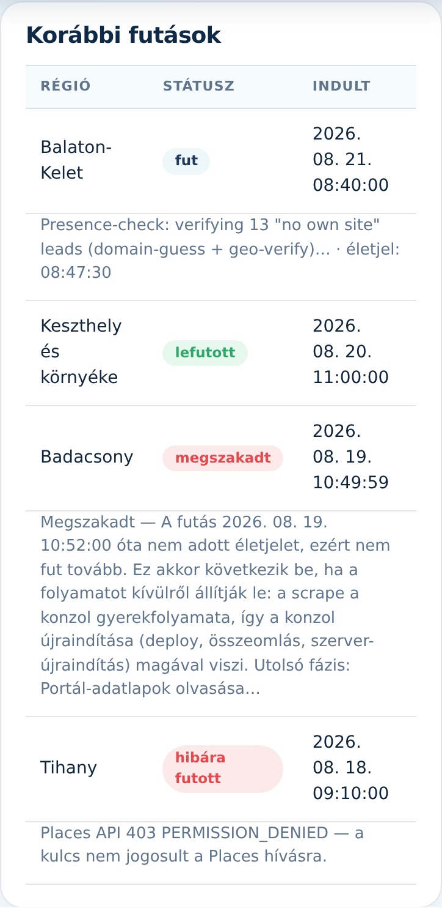

A Scrape képernyőn indítod egy régió felmérését, és itt követed a futást élő naplóval.
Három fül: **„Indítás”**, **„Térkép”** és **„Területek”**.

## Futás indítása

A **„Scrape indítása”** panelben:

1. Válaszd ki a **„Régió”** listából a felmérendő területet.
2. A **„Cap”** mezőbe írhatsz felső korlátot (pl. 40) — a futás Google Places API-hívásokkal jár
   (költség), a cap ezt fogja vissza. Üresen hagyva a teljes régiót felméri.
3. Koppints a **„Scrape indítása”** gombra. Futás közben az oldal 3 másodpercenként magától
   frissül, és a napló élőben mutatja, mit talál.

Egyszerre egy futás mehet; a duplikátum-védelem miatt az újra-scrape a már meglévő leadeket
kihagyja (nem duplikál), a diszkvalifikáltakat sem támasztja fel.

## Korábbi futások

A **„Korábbi futások”** táblázat futásonként mutatja a régiót, a státuszt, az indulás időpontját
(a te órád szerint), majd a talált szereplő- és lead-számot. A sor ALATT teljes szélességben ott a
magyarázó mondat — ez telefonon is végig olvasható, nem kell hozzá oldalra húzni.

> 📱 Telefonon a táblázat szélesebb a képernyőnél: a **„Szereplő”** és **„Lead”** oszlop
> a jobb szélen van, oda a táblázatot **oldalra kell húzni** (az ujjaddal balra söpörni a
> soron). A magyarázó mondat viszont a helyén marad — az mindig látszik.

A státusz négyféle lehet:

- **„fut”** — éppen dolgozik. A sor alatti mondat megmutatja, melyik lépésnél tart (szó szerint
  az a sor, amit a napló is ír — részben angol, fejlesztői szöveg), és mikor adott utoljára
  életjelet: a futás percenként jelez.
- **„lefutott”** — végigment; a szereplő- és lead-szám ennek a sornak a jobb szélén áll
  (telefonon oldalra húzva látod).
- **„megszakadt”** — a futás nem a saját hibájából állt meg: egyszerűen elhallgatott. Szinte
  mindig azért, mert kívülről leállították — a scrape a konzolhoz tapad, így a konzol
  újraindulása (élesítés, szerver-újraindítás, összeomlás) magával viszi. A sor alatti mondat
  megmondja, melyik lépésnél érte a leállítás.
  **Teendő: indítsd el újra.** ⚠️ A leadek a futás VÉGÉN kerülnek be, egyetlen lépésben —
  egy megszakadt futásból tehát semmi nem mentődött el (nulla lead), és az újraindítás a
  Google Places-hívásokat is újra kifizetteti. Erre való a **„Cap”**. Ami korábban már bekerült,
  azt a duplikátum-védelem nem hozza be még egyszer.
- **„hibára futott”** — a futás magától elhasalt; a sor alatti hibaüzenet mondja meg, min.
  Itt az újraindítás önmagában rendszerint nem elég: előbb a hibaokot kell megszüntetni.

> Ha egy futás elhal (például elindítasz egy scrape-et, és közben élesítés történik), a lista ezt
> néhány percen belül magától „megszakadt”-ra váltja, amint ránézel a lapra. Ami korábban
> napokig „fut”-ot mutatott egy rég halott futásra, az nem fordulhat elő.

## Térkép és Területek

- A **„Térkép”** fülön minden eddig felderített lead egy-egy színes pont (piros = nincs honlapja,
  sárga = elavult, zöld = modern), a scrape-területek körei alatta — egy pillantásra látszik,
  hol van még fehér folt.
- A **„Területek”** fülön veszel fel új felmérendő kört: címkereséssel vagy a térképre
  koppintva jelölöd a középpontot, a csúszkával a sugarat. A terület mentés után megjelenik az
  Indítás fül régió-listájában.
