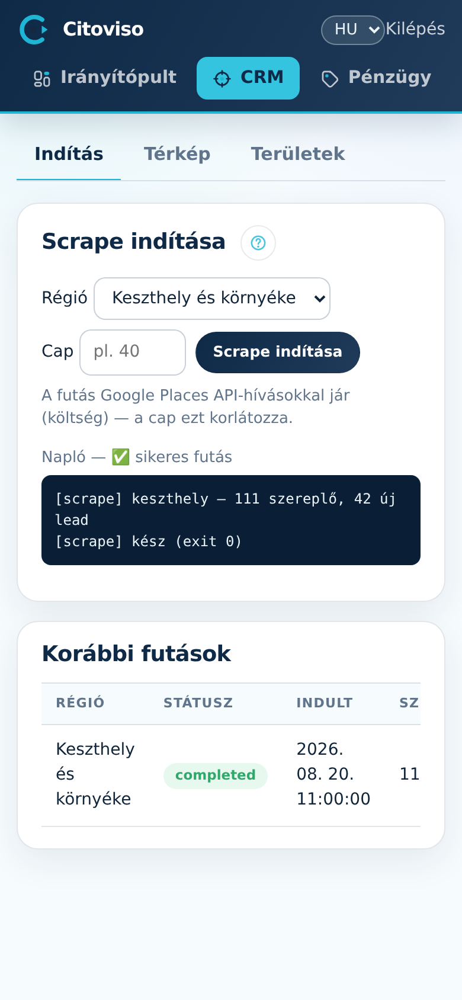

A Scrape képernyőn indítod egy régió felmérését, és itt követed a futást élő naplóval.
Három fül: **„Indítás”**, **„Térkép”** és **„Területek”**.

## Futás indítása

A **„Scrape indítása”** panelben:

1. Válaszd ki a **„Régió”** listából a felmérendő területet.
2. A **„Cap”** mezőbe írhatsz felső korlátot (pl. 40) — a futás Google Places API-hívásokkal jár
   (költség), a cap ezt fogja vissza. Üresen hagyva a teljes régiót felméri.
3. Koppints a gombra. Futás közben az oldal 3 másodpercenként magától frissül, és a napló élőben
   mutatja, mit talál.

Egyszerre egy futás mehet; a duplikátum-védelem miatt az újra-scrape a már meglévő leadeket
kihagyja (nem duplikál), a diszkvalifikáltakat sem támasztja fel.

## Korábbi futások

A **„Korábbi futások”** táblázat futásonként mutatja a régiót, a státuszt, a talált szereplő- és
lead-számot, és hibánál a hibaüzenetet. A „failed” sor hibaoka alapján döntesz: újraindítod, vagy
előbb a területet igazítod.

## Térkép és Területek

- A **„Térkép”** fülön minden eddig felderített lead egy-egy színes pont (piros = nincs honlapja,
  sárga = elavult, zöld = modern), a scrape-területek körei alatta — egy pillantásra látszik,
  hol van még fehér folt.
- A **„Területek”** fülön veszel fel új felmérendő kört: címkereséssel vagy a térképre
  koppintva jelölöd a középpontot, a csúszkával a sugarat. A terület mentés után megjelenik az
  Indítás fül régió-listájában.
