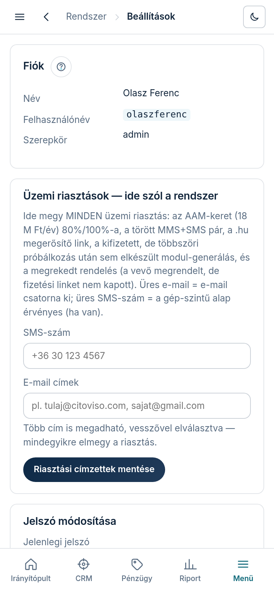

A **„Beállítások”** képernyőn látod a saját operátor-fiókod adatait, itt állítod be az
üzemi riasztások címzettjeit, és itt cserélsz jelszót. A konzol nyilvános
hosztingon is él (nem a hálózat véd, hanem a belépés) — az erős jelszó ezért nem formalitás.

## A fiók-adatok

A **„Fiók”** panel a nevedet, a felhasználónevedet és a szerepkörödet mutatja. Ezek itt nem
szerkeszthetők — új operátort vagy szerepkör-módosítást a rendszergazda vesz fel.

## Üzemi riasztások — ide szól a rendszer

Itt adod meg, **hova szóljon a rendszer, ha baj van**. Ugyanez a két címzett kapja az
összes üzemi riasztást:

- az **AAM-keret** (alanyi adómentesség, 18 M Ft/év) 80%-a és 100%-a — évente és
  küszöbönként egyszer;
- a **törött MMS+SMS pár** (a leadnél kép maradt link és leiratkozás nélkül);
- a **.hu Nyilvántartó megerősítő linkje**;
- a **kifizetett, de többszöri automatikus próbálkozás után sem elkészült
  modul-generálás** — ilyenkor a vevő fizetett, a termék pedig nincs meg.

Az **„Üzemi riasztások — ide szól a rendszer”** panelben:

1. **„SMS-szám”** — a riasztó SMS címzettje. Üresen hagyva a gép-szintű alapértelmezett
   szám érvényes (ha van ilyen beállítva — a mező halvány szövege mutatja); azt is a
   rendszergazda kezeli.
2. **„E-mail címek”** — a riasztó levél címzettje. **Több cím is megadható, vesszővel
   elválasztva** (pl. a céges és a magán fiókod is). Üresen hagyva az e-mail csatorna
   kikapcsolva.
3. Koppints a **„Riasztási címzettek mentése”** gombra. Siker esetén zöld visszajelzést
   kapsz; hibás telefonszámnál vagy e-mail címnél a panel **megnevezi, melyik cím** nem
   jó, és ilyenkor a mentés NEM történik meg — nehogy azt hidd, hogy mind a három címre
   megy a riasztás, miközben csak kettőre (a telefonszámot 06-os alakban is beírhatod, a
   rendszer +36-osra alakítja).

## Jelszó módosítása

A **„Jelszó módosítása”** panelben:

1. **„Jelenlegi jelszó”** — a mostani jelszavad (enélkül nem enged tovább; így egy őrizetlenül
   hagyott gépen sem tud más jelszót cserélni).
2. **„Új jelszó (min. 8 karakter)”** — az új jelszó. Hosszú és megjegyezhető a jó: három-négy
   összefűzött szó erősebb, mint egy rövid, kriksz-kraksz jelszó.
3. **„Új jelszó még egyszer”** — elgépelés ellen.
4. Koppints a **„Jelszó mentése”** gombra. Siker esetén zöld visszajelzést kapsz; hibánál a
   panel megmondja, mi nem stimmelt (pl. a két új jelszó nem egyezik).

A csere azonnal él, a következő belépésnél már az új jelszó kell. Kijelentkezni a fejléc
„Kilépés” linkjével tudsz.

## Elfelejtett jelszó

Belépett állapotban itt cserélsz; ha kizártad magad, a belépő-oldal „Elfelejtett jelszó?"
útmutatója szerint a rendszergazda tud új jelszót beállítani.
