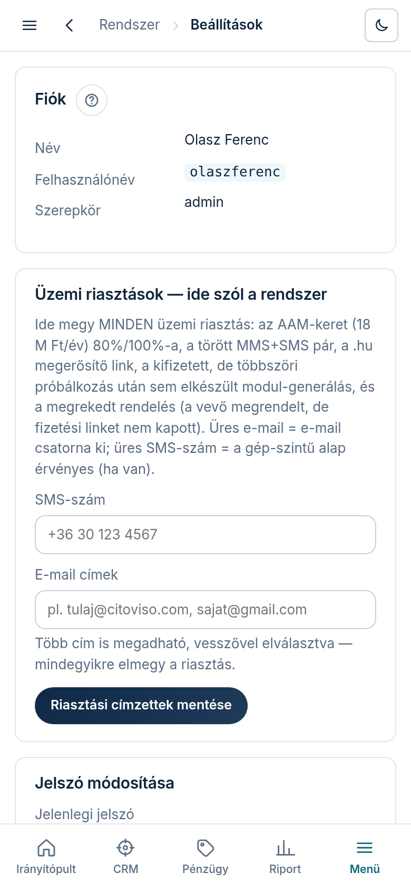

A **„Beállítások”** képernyőn látod a saját operátor-fiókod adatait, itt állítod be az
üzemi riasztások címzettjeit, és itt cserélsz jelszót. A konzol nyilvános
hosztingon is él (nem a hálózat véd, hanem a belépés) — az erős jelszó ezért nem formalitás.



## A fiók-adatok

A **„Fiók”** panel a nevedet, a felhasználónevedet és a szerepkörödet mutatja. Ezek itt nem
szerkeszthetők — új operátort vagy szerepkör-módosítást a rendszergazda vesz fel.

## Üzemi riasztások — ide szól a rendszer

Itt adod meg, **hova szóljon a rendszer, ha baj van**. Ugyanez a két címzett kapja az
összes üzemi riasztást:

- az **AAM-keret** (alanyi adómentesség, 18 M Ft/év) 80%-a és 100%-a — évente és
  küszöbönként egyszer;
- a **törött MMS+SMS pár** (a leadnél kép maradt link és leiratkozás nélkül);
- a **sorban álló MMS, ami elbukott vagy ismeretlen kimenetű** (tárgy: „Citoviso: MMS
  3 kísérlet után sem ment ki — <szám>” vagy „Citoviso: MMS kimenete ISMERETLEN — <szám>”):
  a dev gép relay-e háromszor nem tudta elküldeni, vagy küldés közben szakadt meg és nem
  nyugtázta; a levél megírja a címzettet, a prospectet, a kísérletek számát és a teendőt (a
  relay naplója a dev gépen);
- a **.hu Nyilvántartó megerősítő linkje**;
- a **kifizetett, de többszöri automatikus próbálkozás után sem elkészült
  modul-generálás** — ilyenkor a vevő fizetett, a termék pedig nincs meg;
- a **kifizetett rendelés, amihez NEM készült számla** — a vevő fizetett, a számlázó
  (Számlázz.hu) viszont elutasította a kiállítást (például mert a fiók nincs összekötve a
  NAV Online Számlával). Az első bukáskor jön egy levél; utána a rendszer naponta egyszer
  (a reggeli számlázási futásban) magától újrapróbálja, összesen legfeljebb háromszor, és
  amikor a keret elfogy, még egy levél jön „újrapróbák elfogytak” jelöléssel. A levél
  megírja a számlázó hibaszövegét és a teendőt: ha a hiba a Számlázz.hu fiók beállításáról
  szól, azt ott kell rendbe tenni; a számlát utána azonnal is ki lehet adni a levélben
  szereplő paranccsal (a sikertelen kézi próba is fogyasztja a hármas keretet). Két számla
  ebből nem lesz: a már kiállított számlát a rendszer nem adja ki újra;
- a **megrekedt rendelés** — a vevő végigment a konfigurátoron és megrendelt, de fizetési
  linket nem tudtunk kiadni neki (például mert a mockját a kurátor elutasította, vagy a
  fizetési szolgáltató hibázott). A rendelés rögzült, a pénz nem;
- az **elakadt ingyenes próba** (tárgy: „Citoviso: ingyenes próba — …”) — öt eset: a lejárt
  próba nem szünetelt, a lejárat előtti figyelmeztetés nem ment ki, az elindult próba oldala
  nem él, a kifizetett folytatásból nem lett számla vagy előfizetés, a próbázó nem kapta meg a
  belépő-levelet. Mindegyiknél mit jelent és mit tegyél: a Súgóban az „Ingyenes próba” téma.

### Mit tegyél megrekedt rendelésnél?

A levél megírja a lead nevét, az összeget, a vevő e-mail címét, a rendelés azonosítóját és
az elutasítás okát. A vevő közben azt a tájékoztatást kapta a képernyőn, hogy **egy
kollégánk felveszi vele a kapcsolatot** — ez a levél az a kolléga, tehát a labda nálad van.

A levélben szereplő elutasítási ok dönti el, mi a teendő. A lead lapján a **„Csomag és
fizetés”** fülön, a rendelés sorában van egy **„Fizetési kérés küldése ▸”** gomb — de ez
nem mindig segít, és nem is mindig látszik. Ok szerint:

**`mock_rejected` — a mockot elutasították.** A gomb LÁTSZIK, de hatástalan: hiába nyomod
meg, link nem születik. Ez szándékos — az elutasítás a te kimondott nemed a mock
tartalmára, és elutasított mockot nem élesítünk. A felületen ezért nincs rajta „mégis
jóváhagyom”, és az sem segít, ha új mockot generálsz: **ez a rendelés** ahhoz az
artifacthoz van kötve, amit a vevő látott, és a kötés utólag nem íródik át. A helyes
lépés: **keresd meg a vevőt** (a levélben ott a címe), és ha üzletileg rendben van, kérd
meg, hogy a friss, jóváhagyott mock linkjén adja le újra a rendelést — az új rendelés már
az új mockhoz kötődik, és magától kiadja a fizetési linket.

**`gateway_error` — a fizetési szolgáltató hibázott.** Itt épp fordítva: a gomb ilyenkor
rendszerint **eltűnik**, mert a hiba pillanatában már létrejött egy függőben lévő
fizetés-sor, és a felület nem ad ki két linket ugyanarra. Ha a sor ott ragadt, a
rendezéshez **fejlesztői beavatkozás kell** — jelezd.

**`unknown` — rendszerint lezárt piac.** A vevő országára nincs jóváhagyott jogi csomag, a
gomb pedig látszik és hatástalan. A teendő nem a lead lapján van: a **Beállítások** lap
**„Piacok”** panelján kell megnyitni az adott országot (lásd a Piacok súgót) — utána a
gomb már valódi linket ad. Ha az országot üzletileg nem akarod megnyitni, a rendelés nem
teljesíthető: keresd meg a vevőt és mondd meg neki.

**Ha a gomb nem látszik és a rendelés már ki van fizetve** — ilyenkor nincs is dolgod.

**Mit mond a rendelés sora?** A csomag-igény állapotát a fizetései adják:
**„fizetve”**, **„fizetésre vár”**, **„megszakítva”** (a vevő visszalépett a fizetőoldalon),
**„sikertelen”** (a bank elutasította), **„beküldve — még nincs fizetés”**, **„lezárva”** (a rendelést
lezártuk), és **„lezárva — egy későbbi rendelés fizetve”**. Az utóbbi azt jelenti, hogy a vevő visszajött, és egy
újabb rendelését már kifizette. Gomb csak a „beküldve — még nincs fizetés”, a „megszakítva” és a
„sikertelen” sor mellett áll; a többinél nincs, mert ott nincs mit kérni.
A **„Fizetési kérés küldése ▸”** mindig annak a sornak a rendelésére kér fizetést, amelyik mellett áll.

⚠️ Ha megnyomtad a gombot, **a felület nem ír vissza semmit**: az eredményt onnan látod,
hogy a rendelés sorában megjelenik egy fizetés-sor („fizetés: fizetésre vár”) a link-kel.

> 🔧 **Ismert korlát (2026-09-13).** A megrekedt rendelés helyreállítása ma két ponton
> hiányos: a függőben ragadt fizetés-sor eltünteti az egyetlen gombot, és az elutasított
> mockhoz kötött rendelés nem irányítható át egy új mockra. Mindkettő ismert, a javítás
> külön feladat — addig a fenti kerülő utak élnek.

Az **„Üzemi riasztások — ide szól a rendszer”** panelben:

1. **„SMS-szám”** — a riasztó SMS címzettje. Üresen hagyva a gép-szintű alapértelmezett
   szám érvényes (ha van ilyen beállítva — a mező halvány szövege mutatja); azt is a
   rendszergazda kezeli.
2. **„E-mail címek”** — a riasztó levél címzettje. **Több cím is megadható, vesszővel
   elválasztva** (pl. a céges és a magán fiókod is). Üresen hagyva az e-mail csatorna
   kikapcsolva.
3. Koppints a **„Riasztási címzettek mentése”** gombra. Siker esetén zöld visszajelzést
   kapsz; hibás telefonszámnál vagy e-mail címnél a panel **megnevezi, melyik cím** nem
   jó, és ilyenkor a mentés NEM történik meg — nehogy azt hidd, hogy mind a három címre
   megy a riasztás, miközben csak kettőre (a telefonszámot 06-os alakban is beírhatod, a
   rendszer +36-osra alakítja).

## Honnan tudom, hogy tényleg megérkezik a riasztás?

A mentés önmagában nem bizonyíték: attól, hogy a mezőben ott a cím, még nem biztos, hogy a
levél át is megy (elgépelés, spam-szűrő, lejárt postafiók). Van rá egy **próba**, ami valódi
SMS-t és levelet küld a beállított címzetteknek:

```
npx tsx scripts/alert-drill.mts        # szárazon: kiírja, kinek menne
npx tsx scripts/alert-drill.mts --go   # ÉLES: tényleg küld
```

A próba felállít egy eldobható, `PRÓBA-RIASZTÁS (nem valódi ügyfél)` nevű tenantot,
végigfuttatja rajta a feladás-sorozatot, kiváltja az igazi riasztást, majd mindent
visszatakarít. AI-költséget nem termel. A tenant neve szándékosan kimondja, hogy próba —
egy riasztás, ami valódi ügyfélnek látszik, rosszabb, mint a hiány.

## Jelszó módosítása

A **„Jelszó módosítása”** panelben:

1. **„Jelenlegi jelszó”** — a mostani jelszavad (enélkül nem enged tovább; így egy őrizetlenül
   hagyott gépen sem tud más jelszót cserélni).
2. **„Új jelszó (min. 8 karakter)”** — az új jelszó. Hosszú és megjegyezhető a jó: három-négy
   összefűzött szó erősebb, mint egy rövid, kriksz-kraksz jelszó.
3. **„Új jelszó még egyszer”** — elgépelés ellen.
4. Koppints a **„Jelszó mentése”** gombra. Siker esetén zöld visszajelzést kapsz; hibánál a
   panel megmondja, mi nem stimmelt (pl. a két új jelszó nem egyezik).

A csere azonnal él, a következő belépésnél már az új jelszó kell. Kijelentkezni a fejléc
„Kilépés” linkjével tudsz.

## Elfelejtett jelszó

Belépett állapotban itt cserélsz; ha kizártad magad, a belépő-oldal „Elfelejtett jelszó?"
útmutatója szerint a rendszergazda tud új jelszót beállítani.
